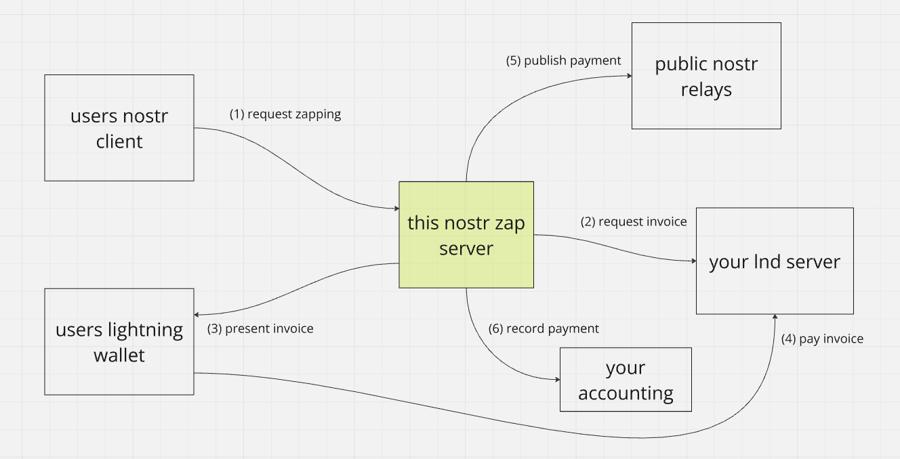
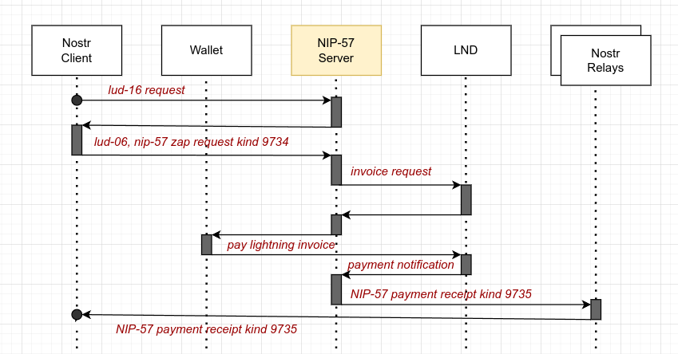

# NIP57 Server

A python server for lightning zaps in the Nostr network, facilitating a self hosted LND instance behind Tor.
Use it to set up a server to recieve lightning zaps in The Nostr. Go self custody - not your keys, not your coins :-)
It's an alternative for Wallet Of Satoshi or getalby.com - but only for tec people.



> :warning: ** This works at real money, test and use with care **

## NIP-57 protocol flow

The protocol is documented in Nostr [NIP-57](https://github.com/nostr-protocol/nips/blob/master/57.md) - my
implementation looks like this:



## What it does

- Be a server
- Provide a payRequest endpoint like in [LUD-06](https://github.com/lnurl/luds/blob/luds/06.md)
- Provide a lnurl pay endpoint like in [LUD-16](https://github.com/lnurl/luds/blob/luds/16.md)
- Provide a nostr zap zapping endpoint like in [NIP-57](https://github.com/nostr-protocol/nips/blob/master/57.md)
- Listen for zap requests kind 9734, REST - send them to the [LND](https://github.com/lightningnetwork/lnd), proxy that
  requests with Tor socks5h
- Deliver the [bech32](https://en.wikipedia.org/wiki/Base32)-serialized lightning invoice to the
  wallet [LUD-06](https://github.com/lnurl/luds/blob/luds/06.md)
- Listen at REST LND for invoice updates
- Create the NIP-57 kind 9735 Event and deliver it to the relays.

## What's missing

- Don't send around big amounts of money... it may fail.
- Handsome manual - how to set up a server in a rented cloud env
- Docker Hub image

## Prerequisites

You'll need a macaroon for your lnd. Bake it like
```lncli bakemacaroon --save_to=./nip57macaroon invoices:write invoices:read```

You'll need the onion address of your rest lnd interface, can find it usually in
```/var/lib/tor/lnd/hostname```

You'll need a tor proxy in SOCKS5H_PROXY. Use the docker compose if you don't have tor running on your host.

- create the users.json with the users you provide the service for
- cp the tls.cert from your lnd instance to here
- cp .env.example to .env and adjust the settings

## Startup

Start up and test looks like this:

```
docker logs nip57-server-server-1

[2024-10-27 10:11:44,471 - INFO] nip57_server NIP57S V3.0.1 starting on port 8080
[2024-10-27 10:11:44,471 - INFO] author contact: nostr:npub18w02exnj7l27t3t0hyxrnfxa8f05dep58nny7z4vur2plsd2gzxqp2hej9
[2024-10-27 10:11:44,471 - INFO] GitHub: https://github.com/feikede/nostr-zap-server
[2024-10-27 10:11:44,471 - INFO] A server to receive lightning lnaddress payments to my own self-custodial LND server.
[2024-10-27 10:11:44,471 - INFO] A server to receive nostr nip-57 zaps to my own self-custodial LND server.
[2024-10-27 10:11:44,471 - INFO] This software is provided AS IS without any warranty. Use it at your own risk.
[2024-10-27 10:11:44,471 - INFO] Config LNURL_ORIGIN: http://localhost:8080
[2024-10-27 10:11:44,471 - INFO] Config MIN_SENDABLE: 10
[2024-10-27 10:11:44,471 - INFO] Config MAX_SENDABLE: 50000
[2024-10-27 10:11:44,471 - INFO] Config DEFAULT_RELAYS: ['wss://nostr.mom/', 'wss://relay.damus.io/', 'wss://nos.lol/']
[2024-10-27 10:11:44,471 - INFO] Config SOCKS5H_PROXY: 
[2024-10-27 10:11:44,471 - INFO] Config LND_RESTADDR: https://example...com
[2024-10-27 10:11:44,471 - INFO] Config INVOICE_MACAROON: 0201036c6e6402...
[2024-10-27 10:11:44,471 - INFO] Config ZAPPER_KEY: 4680bb98e05dab...
[2024-10-27 10:11:44,471 - INFO] Config DYNIP_SECRET: 7fy...
[2024-10-27 10:11:44,471 - INFO] Config TLS_VERIFY: False
[2024-10-27 10:11:44,471 - INFO] Config ACCOUNTING_SECRET: 8GUXR8...
[2024-10-27 10:11:44,471 - INFO] Config ACCOUNTING_URL: https://example...com
[2024-10-27 10:11:44,472 - INFO] Serving on http://0.0.0.0:8080

# dynIP coming in:
[2024-10-27 10:15:49,457 - INFO] LND Rest addr set to https://y.z.29.216:8080

# zap coming in
[2024-10-27 10:20:54,127 - INFO] got nostr invoice request for xx amount 22000 msats
[2024-10-27 10:20:54,193 - INFO] Invoice cache length is 1
[2024-10-27 10:20:54,193 - INFO] Starting LND invoice listener
[2024-10-27 10:21:55,196 - INFO] Got payment of 22000 msats for idx 1852
[2024-10-27 10:21:55,196 - INFO] Sending 9735 event to relays now
[2024-10-27 10:21:55,369 - INFO] LND invoice listener closed, thread ends here


rainer# curl localhost:9080/lnurlp/state
{"state":"SERVER_ACTIVE"}
```

The state request forwards to lnd rest /v1/state

## Dial-Up lines, Dyn-Ip

Tor is sometimes slow, to slow for some zap clients like damus or Amethyst. With the Dial-Up Dyn-Ip feature, you can
connect the
nip57-server to lnd via clearnet.

Path for this is ```/lnurlp/set_clearnet?secret=xyz&ipv4=18.19.20.21&port=8080&tls_verify=False```

The secret must be set in env.

## Issues welcome

Feel free to post issues or merge requests or zap me.

Rainer[@nostr](nostr:npub18w02exnj7l27t3t0hyxrnfxa8f05dep58nny7z4vur2plsd2gzxqp2hej9)

nostr:npub18w02exnj7l27t3t0hyxrnfxa8f05dep58nny7z4vur2plsd2gzxqp2hej9

## Version history

### NIP57S V3.0.1

- added accounting features, changed repo to feikede
